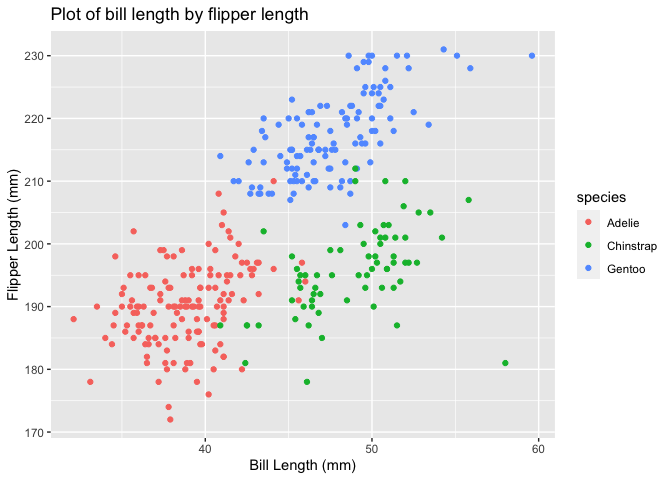

p8105\_hw1\_np2619
================
Nidhi Patel
9/22/2020

``` r
library(tidyverse)
```

    ## ── Attaching packages ─────────────────────────────── tidyverse 1.3.0 ──

    ## ✓ ggplot2 3.3.2     ✓ purrr   0.3.4
    ## ✓ tibble  3.0.3     ✓ dplyr   1.0.2
    ## ✓ tidyr   1.1.2     ✓ stringr 1.4.0
    ## ✓ readr   1.3.1     ✓ forcats 0.5.0

    ## ── Conflicts ────────────────────────────────── tidyverse_conflicts() ──
    ## x dplyr::filter() masks stats::filter()
    ## x dplyr::lag()    masks stats::lag()

## Problem 1

``` r
prob1_df = 
  tibble(
    samp = rnorm(10),
    vec_log = samp > 0,
    vec_char = c("I", "do", "not", "know", "if", "I", "am", "doing", "this", "right"),
    vec_fac = factor(c("orange", "yellow", "purple", "purple", "yellow", "orange", "purple", "purple", "yellow", "orange"))
)

mean_samp = mean(pull(prob1_df, samp))

mean_log = mean(pull(prob1_df, vec_log))


str(prob1_df)
```

    ## tibble [10 × 4] (S3: tbl_df/tbl/data.frame)
    ##  $ samp    : num [1:10] -0.541 -0.695 2.041 2.647 -0.377 ...
    ##  $ vec_log : logi [1:10] FALSE FALSE TRUE TRUE FALSE TRUE ...
    ##  $ vec_char: chr [1:10] "I" "do" "not" "know" ...
    ##  $ vec_fac : Factor w/ 3 levels "orange","purple",..: 1 3 2 2 3 1 2 2 3 1

``` r
#mean_char = mean(pull(prob1_df, vec_char))
#mean_fac = mean(pull(prob1_df, vec_fac))
```

The mean cannot be taken for character or factor vectors as they are not
numeric or logical. However, the mean can be taken for the random sample
and logical vector (sample \>0). In the logical vector, it appears TRUE
= 0 and FALSE = 1.

(To be clear, I wrote the characters before I watched the live video, I
think I did it correctly after watchinf the video\!)

#### Problem 1, continued

``` r
prob1_df$vec_log <- as.numeric(as.factor(prob1_df$vec_log))

mean_log = mean(pull(prob1_df, vec_log))

#prob1_df$vec_char <- as.numeric(prob1_df$vec_char)
#NA introduced by coercion error for the line above

prob1_df$vec_fac <- as.numeric(prob1_df$vec_fac)

mean_fac = mean(pull(prob1_df, vec_fac))
```

Using the as.numeric function, vec\_log and vec\_fac convert to numeric.
Using the same function, vec\_char was not converted, but introduced
NAs.

#### Problem 1, continued again.

Converting and multiplying.

``` r
prob1_df

prob1_df$samp * as.numeric(prob1_df$vec_log)

as.factor(prob1_df$vec_log) * prob1_df$samp
```

    ## Warning in Ops.factor(as.factor(prob1_df$vec_log), prob1_df$samp): '*' not
    ## meaningful for factors

``` r
as.numeric(as.factor(prob1_df$vec_log)) * prob1_df$samp

#str(prob1_df)
```

I converted the logical vector to numeric and multiplied it by the
sample. I was unable to multiply the logical–\> factor vector by the
sample. The factor levels were “TRUE” and “FALSE”, which cannot be
multiplied. When the logical–\> factor vector was converted to numeric,
I was able to multiply it by the sample. There is a difference in the
result because the direct conversion of logical-\> numeric resulted in
“TRUE” = 1 and “FALSE” = 0, but after converting logical to numberic
by way of factor, “TRUE” = 2 and “FALSE” = 1.

## Problem 2

This data set has 344 observations and 8 vectors. There are 3 factor
variables (species, island, sex), 5 numeric vectors (bill length, bill
depth, flipper length, body mass, year). The mean length of penguin
flippers is 200.966967.

``` r
ggplot(omit_pen, aes(x = bill_length_mm, y = flipper_length_mm, color = species)) + geom_point() + xlab("Bill Length (mm)") + ylab("Flipper Length (mm)") + ggtitle("Plot of bill length by flipper length")
```

<!-- -->

``` r
ggsave(filename = "penguin.png")
```

    ## Saving 7 x 5 in image
